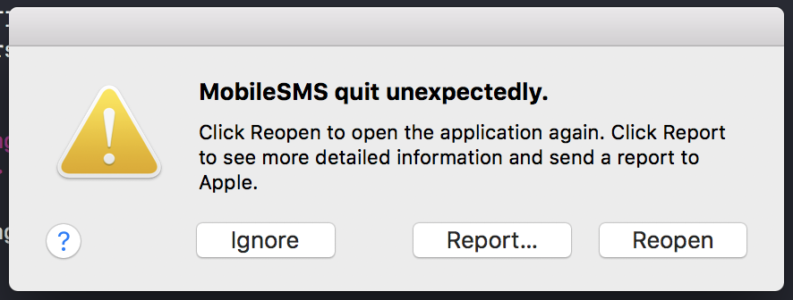
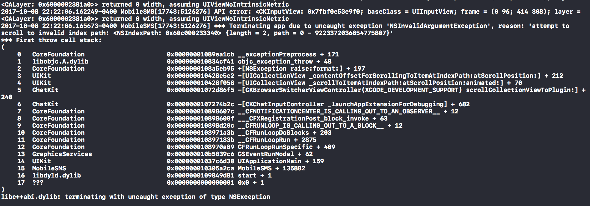

# iOS11 Simulators crash consistently on Message Extensions

iMessage Extensions fail to run on iOS11 based simulators consistently, on XCode9.0 (9A235)



## How to reproduce the issue

Setting `CFBundlePackageType` to `XPC!` will consistently crash iOS11 simulators.

## Example pList
``` xml
<?xml version="1.0" encoding="UTF-8"?>
<!DOCTYPE plist PUBLIC "-//Apple//DTD PLIST 1.0//EN" "http://www.apple.com/DTDs/PropertyList-1.0.dtd">
<plist version="1.0">
<dict>
	<key>CFBundleDevelopmentRegion</key>
	<string>$(DEVELOPMENT_LANGUAGE)</string>
	<key>CFBundleExecutable</key>
	<string>$(EXECUTABLE_NAME)</string>
	<key>CFBundleIdentifier</key>
	<string>$(PRODUCT_BUNDLE_IDENTIFIER)</string>
	<key>CFBundleInfoDictionaryVersion</key>
	<string>6.0</string>
	<key>CFBundleName</key>
	<string>$(PRODUCT_NAME)</string>
	<key>CFBundlePackageType</key>
	<string>XPC!</string>
	<key>CFBundleShortVersionString</key>
	<string>1.0</string>
	<key>CFBundleVersion</key>
	<string>1</string>
    <key>NSExtension</key>
    <dict>
        <key>NSExtensionPointIdentifier</key>
        <string>com.apple.message-payload-provider</string>
        <key>NSExtensionMainStoryboard</key>
        <string>MainInterface</string>
    </dict>
</dict>
</plist>
```
## Stack Trace



## Similar issues in community forums

https://forums.developer.apple.com/message/252075#252075

